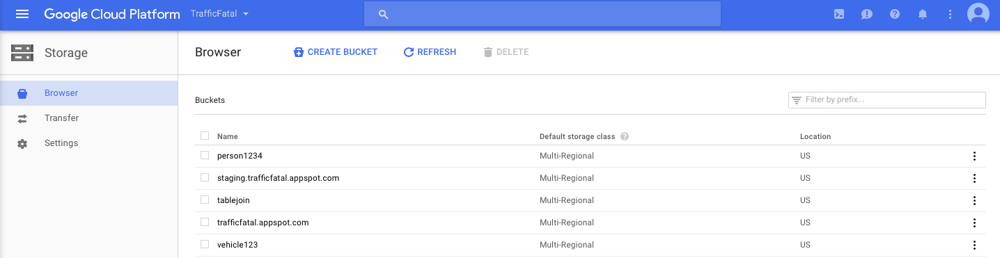

```{r, setup, include=FALSE}
# Load additional packages here 
library(acs)
library(plyr)
library(mlbench)
library(caret)
library(readr)
library(mdsr)
library(randomForest)
library(geepack)
library(gee)
library(broom)
library(ROCR)
library(tidyr)
library(data.table)
library(xtable)
require(tidyr)

# Some customization.  You can alter or delete as desired (if you know what you are doing).
trellis.par.set(theme=theme.mosaic()) # change default color scheme for lattice
knitr::opts_chunk$set(
  tidy=FALSE,     # display code as typed
  size="drivers")   # slightly driverser font for code
```

## Introduction

In 2015, 35092 people died in motor vehicle accidents according to the \href{https://crashstats.nhtsa.dot.gov/Api/Public/ViewPublication/812318}{National Highway Traffic Safety Association (NHTSA).} This is an increase of 2348 fatalities from 2014. Part of the reason that there was an increase in the number of fatal traffic accidents overall is that the number of fatal traffic accidents involving alcohol impaired drivers increased by 322. The \href{https://www.cdc.gov/motorvehiclesafety/impaired_driving/impaired-drv_factsheet.html}{CDC} reports that around 31% of traffic fatalities include a drunk driver and that alcohol impaired vehicle accidents cost around $44 billion.

Although the dangers of drunk driving are well documented at an individual level, the risk factors associated with drunk driving are generally not well known at an aggregate level. There is relatively little literature exploring why there are large discrepancies in rate of drunk driving between different U.S. counties. For example, in 2015, Fremont County, Wyoming, had 27 fatal traffic accidents involving alcohol per 100,000 people whereas the same statistic for Morris County, New Jersey is only 0.2. This difference in drunk driving incidence between the two counties is vast though there is little understanding of how and why these disparities are accentuated based on socioeconomic differences or additional factors. 

Identifying risk factors associated with drunk driving could help develop intervention methods. More specifically, educational programs can be developed to spread awareness about what preventable factors increase the likelihood of drunk driving like time of day and weekend/weekday status. Moreover pinpointing county level disparities in drunk driving related accidents could lead to geographic level government policy implementations like increased budget allocation to spread awareness about safe driving practices in counties with high rates of drunk driving and fatalities. 

In this project, we plan to determine what factors at individual and county level predict whether or not the driver involved in a fatal traffic accident was alcohol impaired. Individual level predictors include driver's sex, age, past driving related convictions. County level predictors of interest include population and income to poverty ratio. Lastly, we also analyze accident level attribute like time of day and week status (weekday/weekend) in potentially explaning drunk driving incidence related to fatal accidents. 

## Data

We used data from two different sources to identify potential risk factors associated with drunk driving related fatal accidents. Our primary source of data was from the Fatality Accident Report Service (FARS) managed by the National Highway Traffic Safety Administration (NHTSA). FARS provides information concerning every vehicle and person involved in a fatal traffic accident. The data is provided at an accident, vehicle, and person level. Each accident is given a unique identifier, and each row of the vehicle and person datasets includes the unique ID indicating which accident that the vehicle or person was a part of. This allowed us to seamlessly join the data together. The manual provided in this \href{https://r.amherst.edu/s/a94bdad037317c6746491/files/git/STAT495-Group3/FARS/Fatality%20Analysis%20Reporting%20System%20(FARS)%20Analytical%20User's%20Manual%201975-2015.pdf}{link} contains information about each variable within the datasets.

The second and supplementary source of data came from the American Community Survey (ACS) conducted by the U.S. Census Bureau. The ACS provides social, economic, and demographic data at the county, state, and national level. The FARS data contains geographic information like latitude, longitude, county, and state. By calculating FIPS codes, we were able to match the county level data we were looking for to each accident, vehicle and person. Information about the ACS can be found \href{https://www.census.gov/programs-surveys/acs/}{here}.

## Data Wrangling 

### BigQuery 

We used Google's BigQuery as a hosting platform for our datasets. BigQuery is an analytics warehouse with the ability to process data on the petabyte scale. It provides a serverless and infrastructure-less environment through its cloud data storage, thereby further reducing the need for a database administrator. Its features include the ability to ingest data from different sources including Google Cloud Storage, Cloud Datastore, and livestream. Data can be read and written via Cloud Dataflow, Spark, and Hadoop and exported out in the Cloud. A key feature of BigQuery is the ability to collaborate and share queries as well as data by adding members to a project. Since we used accident, vehicle and person level data, BigQuery provided a cohesive and structured environment for managing all three. Additionally the user-friendly interface was conducive to basic exploratory analysis with SQL as well as for performing variety of joins. 

  Most basic and preliminary use of BigQuery entails navigating between two environments: Google BigQuery and Google Cloud Platform. Data can be uploaded in BigQuery by first creating a project and enabling both billing and the BigQuery API. Once a project is created, datasets can be added from the 'create a new dataset drop down option' on the highlighted project (available on the left side of the inteface). After specifying a dataset, it is populated by tables of interest. The specification of the table entails defining a schema (structure or data skeleton), which involves defining the variable names as well the data types for each variable as shown by Figure 1. 
  
  

  
Once the data is exported in a table, it can be previewed and queried through the 'compose query tab' on the left (see Figure 2). 

  
 
  
  After the data is queried, the resulting table can be exported out to the Cloud by first creating a bucket from the Cloud console. Buckets can be created by selecting the Storage option from the main Cloud Platform console page. After a bucket is created, the queried data can be exported to that bucket with the name of the bucket and filename specified in format: gs://tablejoin/accident.csv where tablejoin is the name of the folder and accident is the name of the csv formatted table (see Figure 3).
  

  
  BigQuery has additional features worth highlighting like the publicly available datasets, which include the National Oceanic and Atmospheric Administration (NOAA) global data obtained from the USAF Climatology Center, US Disease Surveillance data from the CDC, NYC Taxi and Limousine Commission (TLC) Trip Data and GDELT Internet Archive Book Data. 
  
## FARS/ACS datasets 

The FARS dataset was cleaned to remove any observations with unreported sex, drug use and death scence status. A FIPS code column was created and used as the basis for joining the FARS and the ACS datasets so that each driver is matched with the county and state aggregate population and income to poverty ratio measures. We also created weekday and day status predictors. The data given from FARS already had information about the day of the week the accident occurred as well as the time. When dayweek, the variable for day of the week equaled 1 it meant Sunday and when it equaled 7 it meant Saturday so the weekend variable was coded simply to be a binary indicator of weekend using the day of week variable. We coded night for if the accident occurred between the hours of 6pm and 6am and day otherwise. Final predictors of interest as a measure of driver's drunk incidence included the driver's sex (Sex), age (Age), history of previous DWI convictions and driving suspensions (PrevDWIConvictions, PrevSuspensions), driver's police reported drug use and death scene status (ReportedDrugs, DeathSceneStatus), vehicle level attributes like speed before crash (VehicleSpeed), accident level atributes like number of fatalities, weekday status and say status (NumFatalities, WeekdayStatus, DayStatus) and county level variables like total population and income to poverty ratio in the past 12 months of the driver's state and county (TotalPopulation, IncomeToPovRatio). 

## Data Visualization/Exploration

In order to visualize and explore the data, the shiny, leaflet and choroplethr packages were used. The findings from the shiny app will be detailed below, but the app itself can be found at this \href{https://r.amherst.edu/apps/cki17/Maps/}{link}. The shiny app was made up of three components: a marker map made using leaflet and two choropleth maps with different forms of interactivity.

### Marker Map
The first of three components was the marker map. For every fatal accident in the year 2015, there was a circle representing the accident at the location of the accident on the map (using latitude and longitude). The user could choose whether to color code the circles by whether a drunk driver was involved or not, whether it was a weekend or weekday, or whether it was night (between 6pm and 6am) or day. The user could also choose to scale the dot size by the number of fatilities or the number of people involved in the accident. 

Another feature of the marker map is that if a circle is clicked, a pop-up display will show up. The pop-up displays relevant information regarding the accident including whether a drunk driver was involved, the number of vehicles, the number of people, and the number of fatalities. The most important feature of the pop-up is that it displays the unique ID given to each accident. If there is a particularly interesting accident displayed on the marker map and the user would like to look into it, the ID provided the pop-up is essential. The user could take the ID, and match the accident from the map to the corresponding row in the dataset.

Displayed below is the marker map where the color is based on whether a drunk driver or not and the size is based on the number of fatilities in the accident.


And displayed below here is the marker map where the color is based on whether a drunk driver or not and the size is based on the number of people in the accident.


In the first map, the yellow dots are easy to make out whereas in the second map, the yellow dots are muted. This indicates that a drunk driver was not present in the accidents with largest number of people involved. On the other hand, a drunk driver was present in some of the accidents with the largest number of people who died. This indicates that there maybe a direct relationship between whether a drunk driver was involved in an accidents and the number of fatalities or an inverse relationship between whether a drunk driver was involved and the number of people who were involved. This is something we explore later.

### Choropleth Map 1

The second of the three components was a choropleth map. The primary use of this component is to see how fatal traffic accidents involving drunk drivers varies from county to county and to explore possible relationships between drunk driving and other predictors. The user could select they wanted a state or a county level choropleth map. The user could also select whether they wanted the choropleth to be based on raw count of accidents or number of accidents per 100,000. Other features include selecting whether the data contained all accidents or only those involving drunk driver; whether to include accidents occurring during the weekend, the weekday, or both; and whether to include accidents occurring during the night, the day, or both. A nice feature of the second component of the shiny app is that it allows the users to zoom in on states they wish to explore further.

Displayed below is a county level choropleth map of the number of fatal accidents involving drunk drivers per 100,000 inhabitants. This was to normalize for population as the larger counties are expected to have larger raw counts. The darker the green the higher the rate of fatal accidents involving a drunk driver in that county.


The visual above confirms that fatal accidents involving drunk drivers is not uniformly distributed. It seems that those counties with large populations (and therefore more raw accidents) seem to have more stable and lower rates of fatal accidents involving drunk drivers. This display also serves to point out the counties and regions with abnormally high rates of fatal traffic accidents involving drunk drivers. In particular, the Mountain West region seems to have the highest share of counties that are very green (and so have the largest rates of accidents involving drunk drivers).


The state level display confirms that the Mountain West region has high rates of accidents involving drunk drivers. In addition, the states in the South also seem to have relatively high rates of accidents involving drunk drivers. The Mountain Northwest and
the South regions happens to be two of the poorer and less populated regions of America. This indicates that perhaps population and some measure of income at the county or state level could be valuable predictors for whether a driving involved in an accident was drunk or not.

The last component of the shiny app will be discussed after our analysis is discussed.


```{r}
set.seed(495)
load("FinalDataUpdate.Rda")
n <- nrow(Update1)
shuffled <- Update1[sample(n),]
train <- shuffled[1:round(0.7 * n),]
test <- shuffled[(round(0.7 * n) + 1):n,]
```

## Data Modeling (Logistic and Random Forest) 

### Logistic Regression Conditions Assessment

Binary dependent response variable (drunk or not drunk) was used, which satisfies the condition that response variable be dichotomous for binary logistic regression. A correlation matrix was used to assess whether the quantitative explanatory variables (Age, PrevSuspensions, PrevDWIConvictions, NumFatalities, IncomeToPovRatio and TotalPopulation) were independent or had some underlying unaccounted dependence structure. As the correlation matrix shows below, there does not appear to be much correlation between the explanatory predictors aside from the correlation between total population and income to poverty ratio variables, which seems understandable given that a county with a high total population may have a high income to poverty ratio. Therefore the explanatory predictors mostly satisfied the independence assumption. 

```{r results = "asis"}
modelAssess <- Update1 %>% dplyr::select(Age, PrevSuspensions, PrevDWIConvictions,
                                         NumFatalities, IncomeToPovRatio, TotalPopulation)
modelAssess$NumFatalities <- as.numeric(modelAssess$NumFatalities)
corTable <- cor(modelAssess)
print(xtable(corTable, caption = 'Assessing Independence with Correlation', caption.placement = 'top'))
```

Next we assessed the linearity assumption of logistic regression. Linearity assumption was satisfied for binary predictors like Sex, WeekdayStatus and DayStatus. For quantitative predictors, empirical logit plots were used to assess linearity. As the plots show, linearity assumption is mostly satisfied for these predictors. PrevDWIConvictions and PrevSuspensions predictors show some deviation from normality though the deviation is not especially great. 

```{r}
emplogit = function(x, y, binsize = NULL, ci = FALSE, probit = FALSE,
                    prob = FALSE, main = NULL, xlab = "", ylab = ""){
  if (length(x) != length(y))
    stop("x and y lengths differ")
  if (any(y < 0 | y > 1))
    stop("y not between 0 and 1")
  if (length(x) < 100 & is.null(binsize))
    stop("Less than 100 observations: specify binsize manually")

  if (is.null(binsize)) binsize = min(round(length(x)/10), 50)

  if (probit){
    link = qnorm
    if (is.null(main)) main = "Empirical probits"
  } else {
    link = function(x) log(x/(1-x))
    if (is.null(main)) main = "Empirical logits"
  }

  sort = order(x)
  x = x[sort]
  y = y[sort]
  a = seq(1, length(x), by=binsize)
  b = c(a[-1] - 1, length(x))

  prob = xmean = ns = rep(0, length(a)) # ns is for CIs
  for (i in 1:length(a)){
    range = (a[i]):(b[i])
    prob[i] = mean(y[range])
    xmean[i] = mean(x[range])
    ns[i] = b[i] - a[i] + 1 # for CI 
  }

  extreme = (prob == 1 | prob == 0)
  prob[prob == 0] = min(prob[!extreme])
  prob[prob == 1] = max(prob[!extreme])

  g = link(prob) # logits (or probits if probit == TRUE)

  linear.fit = lm(g[!extreme] ~ xmean[!extreme])
  b0 = linear.fit$coef[1]
  b1 = linear.fit$coef[2]

  loess.fit = loess(g[!extreme] ~ xmean[!extreme])

    plot(xmean, g, main=main, xlab=xlab, ylab=ylab)
    abline(b0,b1)
    lines(loess.fit$x, loess.fit$fitted, lwd=2, lty=2)
}

FinalData <- Update1
par(mfrow=c(2,3))
favstats(FinalData$PrevDWIConvictions)
FinalData$DriverDrinking <- as.numeric(FinalData$DriverDrinking)
FinalData$DriverDrinking <- as.numeric(FinalData$DriverDrinking)
FinalData$DriverDrinking[FinalData$DriverDrinking == 1] <- 0
FinalData$DriverDrinking[FinalData$DriverDrinking == 2] <- 1

emplogit(FinalData$Age, FinalData$DriverDrinking)
title(sub = "Age")
emplogit(FinalData$PrevDWIConvictions, FinalData$DriverDrinking)
title(sub = "PrevDWIConvictionc")
emplogit(FinalData$PrevSuspensions, FinalData$DriverDrinking)
title(sub = "PrevSuspensions")
emplogit(FinalData$TotalPopulation, FinalData$DriverDrinking)
title(sub = "TotalPopulation")
emplogit(FinalData$IncomeToPovRatio, FinalData$DriverDrinking)
title(sub = "IncomeToPovRatio")
```

Lastly, logistic regression also demands independence between observations. Given that we are incorporating county level data, it may be the case that drivers from a particular county may have similar driving and drunk driving experience based on the rules and regulations enforced by that county. Therefore some correlation at the county level may be present, which our model does not fully account for (see the Limitations and Future Work section for further explication on the issue). 

### Test and Training Sets

The dataset was then split in test and training sets with a 70/30 split (70% data in training and 30% in test set) where the training set had 27,214 observations while the test set had 11,663 observations. Logistic regression was used first to assess whether drunk driving incidence can be predicted by the above mentioned predictors followed by random forest. Both models were built on the training data and then assessed on the test data via accuracy and ROC curves.

### Results and Model Analysis

#### Predictors associated with increased drunk driving incidence

Predictors accounting for the driver's previous suspensions and revocations, previous DWI convictions, number of fatalities in the accident, the day of the crash being a weekend and time being night and total population all increase the odds of a driver being drunk. 

  Exponential of the coefficient estimates was assessed in the column labeled ExpEstimate (since logistic model is used, exponentiating the coefficients allows for a more intuitive interpretation). The coefficient for PrevSuspensions indicates that holding other variables constant, the odds of a driver involved in a fatal accident being drunk increase by 1.04 given an increase in the previous suspension record by one. Coefficient for PreDWIConvictions indicates that an increase in the previous DWI convictions by one produces an increase in the odds of the driver being drunk by about 2.74 holding other variables fixed. 
  
  In regards to accident and county level attributes, increase in number of fatalities by one inceases the odds of a driver involved in fatal accident being drunk by about 1.02. If the day of crash is a weekend, then there is about a 1.96 odds of a drunk driver incidence in comparison to if the crash occurred on a weekday. If the time occurred during night, then there is about a 4.01 odds of the driver being drunk than if the crash occurred during the day. Lastly the odds of a drunk driver increase by about 1.00 given a one unit increase in the total population holding other variables fixed. 

#### Predictors associated with decreased drunk driving incidence

Predictors like the driver's sex, age, history of previous speeding suspensions, number of fatalities and income to poverty ratio all decreased the odds of a driver being drunk. 

  The coefficient for Sex indicates that holding other variables constant, if the driver is female, then there is about a 0.56 odds of a driver being drunk than if the driver was a male. Age indicates that the odds of a driver being drunk are about 0.98 higher given a one year increase in age. Lastly an increase in income to poverty ratio of one is associated with a 0.99 increased odds of the driver being drunk. 
  
```{r}
logmodnew <- glm(formula = DriverDrinking ~ Sex + Age + PrevSuspensions + 
                PrevDWIConvictions + NumFatalities + WeekdayStatus + DayStatus + 
                IncomeToPovRatio + TotalPopulation,
              family=binomial(link='logit'), data = train)
save(logmodnew, file = "logisticmodFinal.Rda")
logmod <- logmodnew 
logTable <- tidy(logmod)
logTable <- logTable %>% mutate(ExpEstimate = exp(estimate))
logTable <- logTable %>% dplyr::select(term, estimate, ExpEstimate, std.error, p.value)
logTable <- rename(logTable, Estimate = estimate)
logTable <- rename(logTable, Term = term)
logTable <- rename(logTable, StdError = std.error)
logTable <- rename(logTable, PValue = p.value)
logTable  #added exponentiated estimate column in the model summary 
```

### Logistic Regression Model Accuracy 

Logistic regression was assessed with model accuracy. Cross validation with k = 100 (data is iteratively split in training and test sets 100 times and accuracy is computed and averaged) was used. The accuracy from cross validation was about about 0.81. 

```{r}
#Cross-validation for model assessment 
dat <- FinalData
k <- 100
acc <- NULL
set.seed(123)

for(i in 1:k)
{
  smp_size <- floor(0.70 * nrow(dat))
  index <- sample(seq_len(nrow(dat)),size=smp_size)
  train <- dat[index, ]
  test <- dat[-index, ]
  model <- glm(formula = DriverDrinking ~ Sex + Age + PrevSuspensions + 
                 PrevDWIConvictions + NumFatalities + WeekdayStatus + 
                 DayStatus + IncomeToPovRatio + TotalPopulation,
              family=binomial(link='logit'), data = train)
  results_prob <- predict(model,newdata=test,type='response')
  results <- ifelse(results_prob > 0.5,1,0)
  answers <- test$DriverDrinking
  misClasificError <- mean(answers != results)
  acc[i] <- 1-misClasificError
}
mean(acc)
```


### Random Forest 

#### Variable Importance 

In addition to logistic regression, random forest was built to assess variable importance. Random forest is an ensemble modeling approach where output from many bootstrapped decision trees is aggregated to provide an estimate. About 100 trees were grown for the random forest model and the same predictors were regressed to predict drunk driving incidence as used for the logistic regression (Sex, Age, PrevDWIConvictions, PrevSuspensions, NumFatalities, WeekdayStatus, DayStatus, TotalPopulation, IncomeToPovRatio). 

  Variable importance plot was constructed to assess which features are highly predictive in forecasting drunk driving incidence. Mean decrease in accuracy and mean decrease in gini index (measure of the model misclassification rate) were used to assess importance. County level income to poverty ratio was the most important predictor according to the mean decrease accuracy index which means that exclusion of this predictor from the model would result in the highest decrease in accuracy. In comparison, total population was the most important predictor according to the mean decrease gini index indicating that total population results in the highest node purity, which signifies a low rate of misclassifying the driver as drunk. Additionally day status and previous driving suspension history were the next important predictors according to both the mean decrease accuracy and the mean decrease gini indices. 
  
  Least important predictors in predicting the drunk driving incident included the driver's sex and number of fatalities according to both mean decrease accuracy and mean decrease gini indices. Weekday status also does not appear to be a very informative predictor in predicting drunk driving incidence. 
  
```{r}
set.seed(1000)
train$DriverDrinking <- as.factor(train$DriverDrinking)
modForest <- randomForest(DriverDrinking ~ Sex + Age + PrevSuspensions + PrevDWIConvictions + 
                          NumFatalities + WeekdayStatus + DayStatus + IncomeToPovRatio + 
                          TotalPopulation, data = train, ntree = 100, mtry = 4, 
                        keep.forest = TRUE, importance = TRUE)
#save(modForest, file = "modForest.Rda")
#Importance plots  
varImpPlot(modForest)
```

### Random Forest Model Assessment  

Random forest model was assessed with accuracy validated through cross-validation. K value of 50 was specified in cross-validation, indicating that the data was split in a test and training set 50 times and accuracy was calculated each time, producing an aggregate estimate of accuracy of about 0.81. 

```{r}
dat <- FinalData
k <- 50
acc2 <- NULL
set.seed(123)
for(i in 1:k)
{
  smp_size <- floor(0.70 * nrow(dat))
  index <- sample(seq_len(nrow(dat)),size=smp_size)
  train <- dat[index, ]
  test <- dat[-index, ]
  modForest1 <- randomForest(DriverDrinking ~ Sex + Age + PrevSuspensions + PrevDWIConvictions + 
                            NumFatalities + WeekdayStatus + DayStatus + IncomeToPovRatio + 
                            TotalPopulation, data = train, ntree = 100, mtry = 4, 
                          keep.forest = TRUE, importance = FALSE)
  conf <- modForest1$confusion
  acc2[i] <- (sum(diag(conf)) / sum(conf))
}
mean(acc2)
```


## Discussion 

According to the results above, county level predictors like income to poverty ratio in the past 12 months and total population appear to be the most important predictors in predicting whether or not the driver is drunk. In regards to county level predictors, a more affluent county as indicated by a high income to poverty ratio may be more able to purchase and consume alcohol. High total population may be a confounding variable since there might naturally be an increase in the number of accidents as the population increases, irrelevant to the driver's drinking status. Additionally day status predictor is important, which seems intuitive since alcohol consumption typically occurs at night, resulting in increased drunk driving incidence during the night. Previous suspensions and DWI convictions appear to be somewhat important in predicting drunk driving incidence. 

  Driver's sex does not appear to be relevant in predicting drunk driving incidence. Number of fatalities is not an important variable indicating that the intensity of the crash as measured by the number of deaths in an accident does not predict the drunk driving incidence. 
  
## Limitations and Future Work

There are a few important limitations to our work. First, the FARS dataset only accounts for accidents leading to fatalities. So our models are technically predicting whether a driver involved in a fatal accident was drunk or not. The models may lose predictive value if used to determine drunk driving incidence for a driver involved in any accident (not necessarily one that involved a fatality). Second, we do not believe that observations in our dataset are independent from each other. As we noticed, there was a large difference in rates of drunk driving between certain counties. This indicates that there is some county level effect with a high chance of correlation between county level observations. This is a violation of the assumptions of logistic regression. In the future, generalized estimating equations (GEE) can be used to address this violation. 

There are several natural extensions of this project that can be taken. We only included data from the year 2015 in our current analysis but would like to include additional years in consideration. Since we only included observations from counties where there were at least 10 fatal accidents, by adding more observations from different years, more counties could have been included in the analysis. Additionally, a different set of questions could have been answered by adding more years. For example, as indicated in the motivation/introduction section, there was an increase in the number of fatal traffic accidents (both overall and alcohol induced). By adding more years, one could try to ascertain why 2015 saw an increase in fatal accidents when previous years observed a decrease. 

In our current model, we aggregated individual level driver attributes like age and sex to allow for modeling the county level estimates. Future exploration could include analyzing how the model estimates change if the data is only fit at a county level instead of an aggregation from an individual level. 

#ACS Dataset 
```{r eval = FALSE}
data("fips.state")
data("fips.county")

######Pulling in population data 
mygeo <- geo.make(state = "*", county = "*")
pop <- acs.fetch(endyear=2015, geography = mygeo, 
               table.number = "B01003", 
               key = "3dbabece4401ad72afa36a118e2cf777efa2afb3")
countypop <- as.data.frame(estimate(pop))
countypopT <- setDT(countypop, keep.rownames = TRUE)[]
countypopT <- countypopT %>% rename(StateCounty = rn) %>%
  mutate(StateCounty = as.factor(StateCounty))
levels(countypopT$StateCounty)[levels(countypopT$StateCounty)
                               =="Doña Ana County, New Mexico"] <- "Dona Ana County, New Mexico"

countypopT <- countypopT %>%
  separate(StateCounty, c("County.Name", "STATE_NAME"), ", ") %>% #separator by comma and space 
  mutate(STATE_NAME = as.factor(STATE_NAME))

#merge county and state data 
fips.state <- fips.state %>% mutate(STATE_NAME = as.factor(STATE_NAME)) %>%
  rename(State = STUSAB)

joinedData <- right_join(fips.state, fips.county, by = "State") #joinedData merge state and county by state 
joinedData <- joinedData %>% mutate(County.Name = as.factor(County.Name))
countypopT <- countypopT %>% mutate(County.Name = as.factor(County.Name))

FinalPop <- inner_join(joinedData, countypopT, by = c("County.Name", "STATE_NAME")) %>%
  mutate(FIPSCode = ((1000*State.ANSI) + County.ANSI)) #find fips encoding

#####Pulling in Poverty to Income ratio data
income <- acs.fetch(endyear=2015, geography = mygeo, 
               table.number = "C17002", 
               key = "3dbabece4401ad72afa36a118e2cf777efa2afb3")

income <- as.data.frame(estimate(income))
income <- income %>% dplyr::select(C17002_001)
incomeT <- setDT(income, keep.rownames = TRUE)[]
incomeT <- incomeT %>% rename(StateCounty = rn) %>%
  mutate(StateCounty = as.factor(StateCounty))

levels(incomeT$StateCounty)[levels(incomeT$StateCounty)
                               =="Doña Ana County, New Mexico"] <- "Dona Ana County, New Mexico"

incomeT <- incomeT %>%
  separate(StateCounty, c("County.Name", "STATE_NAME"), ", ") %>% #separator by comma and space 
  mutate(STATE_NAME = as.factor(STATE_NAME), County.Name = as.factor(County.Name))

FinalIncome <- inner_join(joinedData, incomeT, by = c("County.Name", "STATE_NAME")) %>% 
  mutate(FIPSCode = ((1000*State.ANSI) + County.ANSI)) #find fips encoding


######Now merge FinalIncom1 and FinalPop1 by FipsCode
FinalCensus <- inner_join(FinalIncome, FinalPop, by = "FIPSCode")
CensusFinalD1 <- FinalCensus %>% dplyr::select(FIPSCode, C17002_001, B01003_001)
#save(CensusFinalD1, file = "CensusFinalD1.Rda")
```

#Drivers Dataset 
```{r eval = FALSE}
drivers <- read.csv("DriversData.csv") #only data for the drivers selected 

#should get around 30000 observations: if more than person involved in an accident 

drivers <- drivers %>% select(V_V_CONFIG, V_TRAV_SP, V_DEFORMED, V_DR_DRINK, V_PREV_ACC, 
                                V_PREV_SUS, V_PREV_DWI, V_PREV_SPD, V_VALIGN, V_VPAVETYP, V_VSURCOND,
                                A_LGT_COND, A_FATALS, A_DRUNK_DR, A_WEATHER, A_WEATHER1, A_WEATHER2,
                                A_WRK_ZONE, A_MAN_COLL, P_AGE, P_SEX, P_INJ_SEV, P_SEAT_POS, 
                                P_AIR_BAG, P_EJECTION, P_EJ_PATH, P_DRINKING, P_DRUGS, 
                                P_LAG_HRS, P_DOA, A_COUNTY, A_STATE, A_CITY, A_DAY_WEEK, A_HOUR)

#Counting the county frequency by fips code
drivers <- drivers %>% unique() %>%
  mutate(A_STATE = readr::parse_number(A_STATE), A_COUNTY = readr::parse_number(A_COUNTY)) %>%
  mutate(FIPSCode = ((1000*A_STATE) + A_COUNTY)) #fips code

countiesL <- tally(drivers$FIPSCode) #tally by FIPSCode
filtereddrivers <- data.frame(countiesL) %>%
  rename(FIPSCode = X) %>%
  mutate(FIPSCode = readr::parse_number(FIPSCode)) %>%
  right_join(drivers) 

#create new variable here: only counties 
filtereddrivers <- filtereddrivers %>%
  filter(Freq > 10) %>%
  mutate(P_SEX = as.factor(P_SEX), P_DRUGS = as.factor(P_DRUGS),
         P_DOA = as.factor(P_DOA), V_DR_DRINK = as.factor(V_DR_DRINK),
         A_STATE = as.factor(A_STATE), A_COUNTY = as.factor(A_COUNTY)) %>%
  rename(state = A_STATE, county = A_COUNTY) %>% 
  mutate(TravSpeed = readr::parse_number(V_TRAV_SP),
         Age = readr::parse_number(P_AGE),
         PDWI = readr::parse_number(V_PREV_DWI),
         PSuspension = readr::parse_number(V_PREV_SUS),
         PCrash = readr::parse_number(V_PREV_ACC),
         PSpeed = readr::parse_number(V_PREV_SPD))

ACS <- load("CensusFinalD1.Rda")
FinalData <- CensusFinalD1 %>% mutate(FIPSCode = readr::parse_number(FIPSCode)) %>% 
  right_join(filtereddrivers, by = "FIPSCode") #40422 observations
FinalData <- na.omit(FinalData)

########Build training and test models here
FinalData <- FinalData %>% 
  rename(IncomeToPovRatio = C17002_001, #Quant
         TotalPopulation = B01003_001, #Quant
         Sex = P_SEX, #Categorical
         PrevDWIConvictions = PDWI, #Quantitative
         PrevSpeeding = PSpeed, #Quantitative
         PrevSuspensions = PSuspension, #Quant
         VehicleSpeed = TravSpeed, #Quant
         ReportedDrugs = P_DRUGS, #Categorical
         NumFatalities = A_FATALS, #Quant
         DeathSceneStatus = P_DOA, #Categorical
         DriverDrinking = V_DR_DRINK) %>% #Categorical
  filter(Sex == '1' | Sex == '2')

FinalData$Sex <- droplevels(FinalData$Sex)
levels(FinalData$Sex) <- c("Male", "Female")

#Creating weekend/weekday predictor 
FinalData <- FinalData %>%
  mutate(WeekdayStatus = ifelse(A_DAY_WEEK == '1' | A_DAY_WEEK == '7', "Weekend", "Weekday"))
FinalData$WeekdayStatus <- as.factor(FinalData$WeekdayStatus)

FinalData <- FinalData %>%
  mutate(DayStatus = ifelse(A_HOUR < 6 | A_HOUR >= 18, "Night", "Day"))
FinalData$DayStatus <- as.factor(FinalData$DayStatus)

#save(FinalData, file = "FinalData.Rda")
```

 