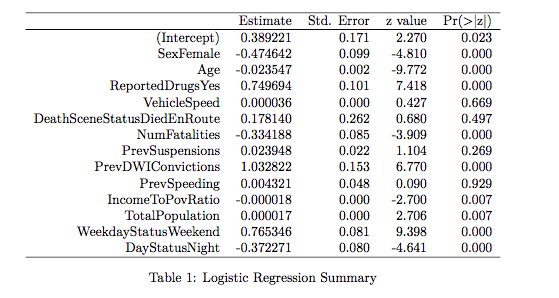

```{r message=FALSE, echo=FALSE}
options(warn = -1)
require(mosaic)
require(ggplot)
library(mosaicData)
library(quantreg)
library(xtable)
library(ROCR)
library(pROC)
require(randomForest)
options(digits=3)
trellis.par.set(theme=theme.mosaic())
```

# Motivation
- Fremont County, Wyoming had 27 fatal traffic accidents involving alcohol per 100,000 people 
- Morris County, New Jersey had 0.2 fatal traffic accidents involving alcohol per 100,000 people
- What accounts for the disparity in these traffic fatalities?

# Background 
- Over 30000 people die in motor vehicle accidents every year 
- Alcohol-impaired driving incidents account for about 30% of these deaths
- Cost of alcohol-related crashes generally exceeds the cost of non-alcohol related crashes

# Question 
- What factors contribute to drunk driving at an individual and socioeconomic county-level?

# Data Description
- Primary data comes from the National Highway Traffic Safety Administration (NHTSA) through the Fatality Analysis Reporting System (FARS)
    - Datasets containing information about the vehicle, accident, and people involved
- Supplementary data comes from the U.S. Census Bureau through the American Community Survey (ACS)
    - Provides economic, social, and demographic data at county and state levels
    
    
# Google BigQuery 

- Cloud base serverless analytics data warehouse 
- Platform for performing SQL analysis 
- Designed to process GB/PB scale data 
- Data reading and writing available via Hadoop, Spark and Cloud Dataflow
- Data ingestion abilities available from Google Cloud Storage, Google 
  Cloud Datastore or livestream 
- Facilitates collaboration in an infrastructure-less environment 


# Data Visualization
- Shiny
- Leaflet
- Choroplethr


# Variable Description 

- Attributes characterized by:
    - Driver: Indicator for drunk driving, Sex, Age, Driver history (past suspensions, DWI and speeding convictions), Indicator for death at scene of accident/en route to a medical facility 
    - Vehicle: Vehicle speed prior to crash, Extent of damage
    - Accident: Number of fatalities
    - County-level attributes: Total population, 12-month income to poverty level ratio
    
# Logistic Regression 



# Random Forest 

```{r echo=FALSE, fig.align="center"}
load("FinalLogisticData.Rda")
mergeData$county <- as.factor(mergeData$county)
n <- nrow(mergeData)
shuffled <- mergeData[sample(n), ]
train <- shuffled[1:round(0.7 * n),]
test <- shuffled[(round(0.7 * n) + 1):n,]

train$FIPSCode <- as.factor(train$FIPSCode)
set.seed(1000)
VariableImportance <- randomForest(as.factor(DriverDrinking) ~ Sex + Age + ReportedDrugs + VehicleSpeed + DeathSceneStatus +
                                     NumFatalities + PrevSuspensions + PrevDWIConvictions + PrevSpeeding + IncomeToPovRatio + TotalPopulation + 
                                     WeekdayStatus + DayStatus, data = train, ntree = 50, mtry = 4, keep.forest = FALSE, importance = TRUE)

varImpPlot(VariableImportance)
```


# Model Assessment

```{r echo=FALSE, fig.align="center", fig.height=5.5}
par(mfrow=c(1,2))
load("FinalLogisticData.Rda")
mergeData$county <- as.factor(mergeData$county)
n <- nrow(mergeData)
shuffled <- mergeData[sample(n), ]
train <- shuffled[1:round(0.7 * n),]
test <- shuffled[(round(0.7 * n) + 1):n,]

train$FIPSCode <- as.factor(train$FIPSCode)
train$DriverDrinking <- as.factor(train$DriverDrinking)
logmod <- glm(formula = DriverDrinking ~ Sex + Age + ReportedDrugs + VehicleSpeed + DeathSceneStatus + 
                NumFatalities + PrevSuspensions + PrevDWIConvictions + PrevSpeeding 
              + IncomeToPovRatio + TotalPopulation + WeekdayStatus + DayStatus,
              family=binomial(link='logit'), data = train)

prob <- predict(logmod, newdata=test, type="response")
pred <- prediction(prob, test$DriverDrinking)
perf <- performance(pred, measure = "tpr", x.measure = "fpr")
plot(perf)
title(main="Logistic Regression ROC [Accuracy: 0.67]") 

set.seed(1000)
modForest <- randomForest(as.factor(DriverDrinking) ~ Sex + Age + ReportedDrugs + VehicleSpeed + DeathSceneStatus +  
                                     NumFatalities + PrevSuspensions + PrevDWIConvictions + PrevSpeeding + IncomeToPovRatio + TotalPopulation + 
                                     WeekdayStatus + DayStatus, data = train, ntree = 50, mtry = 4, keep.forest = TRUE, importance = TRUE)
test.forest = predict(modForest, type = "prob", newdata = test)
forestpred = prediction(test.forest[,2], test$DriverDrinking)
forestperf = performance(forestpred, "tpr", "fpr")
plot(perf, main="Random Forest ROC [Accuracy: 0.65]")
#title("Receiver Operating Curve (ROC) [Accuracy: 0.65]")
```

# Conclusions 

- Both models agree that age, previous DWI, reported Drugs, and sex are important predictors
- Total population and income to poverty ratio in a county might help explain the discrepancy in fatal drunk driving incidents
- Weekday status also appears to be an important predictor in predicting drunk driver incidence

# Future work and limitations

- Account for correlation between observations by county level 
    - Use GEE Model
- Extend the study to state level and factor in additional years 
- Predict whether drunk driving was involved at an accident level 
